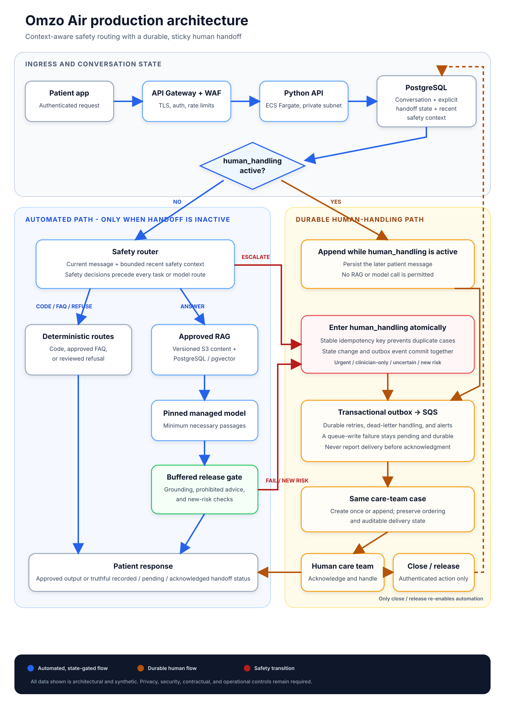

# Omzo Air - System Design - Edion Hashani

## 1. Architecture and message flow

An authenticated request enters API Gateway and WAF, then reaches a stateless Python service on ECS Fargate in private subnets. PostgreSQL stores conversation metadata and an explicit handoff state. Before any task routing or model call, the service loads that state and a bounded window of recent safety context.

If `human_handling` is active, the new message is persisted and appended to the same care-team case; it cannot return to retrieval or the model until an authenticated care-team close or release. Otherwise, a safety router examines the current message plus recent context. Urgent, clinician-only, or uncertain cases atomically enter `human_handling` and write a transactional outbox event. A stable handoff idempotency key prevents duplicate cases. The outbox publishes to SQS with retry and alarms. A failed queue write remains durable, blocks automation, and produces truthful "delivery not yet confirmed" wording rather than claiming a successful handoff.

Greetings, order status, and appointments use normal code. Approved FAQs and refusals return reviewed text. Only general health or wearable questions use RAG over current clinician-approved documents stored in versioned S3 and indexed in PostgreSQL with pgvector. A pinned model receives minimum necessary passages; its complete response is buffered and checked for grounding, prohibited advice, and new risk before release.

ePHI is encrypted in transit and at rest, access is least-privilege, secrets stay in Secrets Manager, and ordinary logs contain opaque IDs rather than message text. AWS and model providers still require appropriate BAAs, configuration, risk analysis, retention controls, and operational policies; code alone does not make the platform HIPAA compliant.

## 2. Three things I would not build at launch

1. No autonomous clinical agent or write-capable model tools: diagnosis, prescriptions, dose changes, and clinical actions stay with humans.
2. No self-hosted or fine-tuned model: two engineers should focus on evaluation, approved knowledge, safety, and handoff reliability.
3. No automatic failover to an unapproved provider: each provider needs separate privacy, contractual, and clinical approval.

## 3. Estimated monthly model cost

I assume pinned `gpt-5.4-mini-2026-03-17` at $0.75/M input tokens and $4.50/M output tokens. Monthly traffic is 525,000 messages: 2.1B input tokens cost $1,575.00 and 157.5M output tokens cost $708.75, totaling $2,283.75. A 10% regional-processing uplift would make it $2,512.13. GPT-4.1 Mini would cost $1,092.00, but GPT-5.4 Mini is the quality-first candidate while remaining under budget; launch still depends on clinical-boundary, grounding, latency, privacy, and cost evaluations.

## 4. What I would build in week 1

I would define clinician-approved boundaries and synthetic evaluations, map ePHI and BAA dependencies, then build one vertical slice: authenticated request, context-aware safety decision, persisted handoff, idempotent outbox delivery, care-team acknowledgment, later-message append, release/close, privacy-safe audit event, and queue-failure tests.

## 5. One number that would trigger redesign

If average input rises from 4,000 to 6,000 tokens, GPT-5.4 Mini input costs $2,362.50 and total model cost becomes $3,071.25 before regional uplift. I would replace full-history replay with structured state, relevant-turn retrieval, and per-route token budgets, then rerun safety and grounding evaluations so cost reduction cannot erase a risk signal.

Pricing checked 7 October 2026: [GPT-5.4 Mini](https://developers.openai.com/api/docs/models/gpt-5.4-mini), [GPT-4.1 Mini](https://developers.openai.com/api/docs/models/gpt-4.1-mini).
